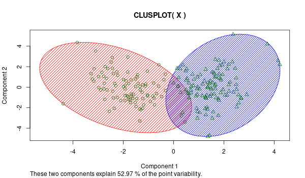

```{r setup, include=FALSE}
knitr::opts_chunk$set(echo = TRUE)
library(dplyr)
library(corrplot)
library(ggplot2)
library(gridExtra)
library(cluster)
library(clustertend)
library(colorspace, pos = 17)
library(caret)
library("scales")
```


## 1. Descripción del dataset. ¿Por qué es importante y qué pregunta/problema pretende responder?

Hemos elegido el dataset `Wine Quality Data Set´ de la fuente: [https://archive.ics.uci.edu/ml/datasets/wine+quality](https://archive.ics.uci.edu/ml/datasets/wine+quality)) que contiene datos de dos clases de vinos portugueses: vino verde (_white wine_) y vino tinto (_red wine_). Los datos incluyen variables fisicoquímicas (acidez, pH, densidad, volatilidad ácida, contenido en alcohol, calidad, etc.), y una variable objetivo sensorial, que representa la calidad del vino.

A la hora de elegir la base de datos hemos tenido en cuenta que es apropiada para responder al ejercicio es decir proceder a la limpieza de datos y realizar tres tipos de análisis de datos.
En cuanto a la limpieza de datos el único inconveniente es la inexistencia de valores nulos, pero podemos aplicar otras técnicas como reducción de la dimensionalidad, análisis de valores extremos y escalar las variables.

En cuanto al análisis de datos pensamos que este es un _dataset_ en el que podemos utilizar métodos supervisados, no supervisados y técnicas de regresión y/o estadísticas como contraste de hipótesis o análisis de la varianza.
Así podemos unir las bases de datos para un tipo de análisis (clasificación, análisis de la varianza) y utilizarlas por separado para otro tipo (regresión).

1. __Problemas no supervisados:__ Es decir cuando a partir de variables dependientes obtenemos información sobre la variable independiente (la cual disponemos para comprobaciones pero no para crear el modelo la cual nos da un plus de maniobrabilidad), ademas los atributos son apropiados para su uso con el algoritmo _k-means_.
En este sentido el hecho de agrupar dos tipos de vinos con los mismos atributos nos permite realizar una agrupación sencilla sin perdernos en los detalles. Vamos a unir las dos bases de datos y vamos a intentar agrupar de forma que al vino blanco se le asigne un grupo y al vino tinto otro grupo utilizando el algoritmo _k_means_.
2. __Regresión lineal:__ A partir de un conjunto de variables dependientes cercanas a una distribución normal, creamos un modelo que aproxima la curva de la variable independiente. En este modelo la hipotesis nula nos indica si hay una fuerte relación entre las variables fisicoquimicas y la calidad, y nos ayuda a entender como cada variable afecta la calidad.
3. __Contraste de hipotesis:__ Como tenemos los datos de dos tipos de vinos (tinto y blanco) es interesante explorar si hay diferencia entre los valores de la variable sensorial (calidad) de cada tipo de vino. Para el test miraremos si las distribuciones son normales, y si podemos usar un test paramétrico. Si no usaremos un test no paramétrico para comparar la calidad de los tipos de vino.

## 2. Integración y selección de los datos de interés a analizar.

En la primera parte cargamos los datos de ficheros CSV, eliminamos registros duplicados, y juntamos los diferentes conjuntos de datos.

```{r}
set.seed(42)
# importamos los datos de los csv descargados
red_wine_data <- read.csv('winequality-red.csv', sep = ";", quote = "\"")
white_wine_data <- read.csv('winequality-white.csv', sep = ";", quote = "\"")
# añadimos el tipo de vino como una nueva variable categórica
red_wine_data$type <- "red"
white_wine_data$type <- "white"
# comprobaremos cuantos registros duplicados hay para cada dataset
sum(duplicated(red_wine_data))
sum(duplicated(white_wine_data))
# eliminaremos los registros duplicados
red_wine_data <- red_wine_data[!duplicated(red_wine_data), ]
white_wine_data <- white_wine_data[!duplicated(white_wine_data), ]
# juntamos los datos seleccionando el mismo número de muestras para cada tipo de vino
white_wine_data <- white_wine_data[sample(nrow(x = white_wine_data),
                                          nrow(x = red_wine_data)),]
dataset <- rbind(red_wine_data, white_wine_data)
dataset$type <- as.factor(dataset$type)
# cantidad de registros disponibles para cada dataset
nrow(dataset)
```

Ahora hacemos el analisis de correlaciones de las variables.

```{r}
# miraremos ahora si hay variables numericas en los datos que tienen alta 
# correlación para el data set conjunto y con las clases de vinos separadas
corrplot(
  cor(dataset[, 0:11], method = 'pearson'),
  type = "upper",
  method = 'number',
  diag = FALSE
)
```

La correlación más alta (0.76) fue entre las variables _free.sulfur.dioxide_ y _total.sulfur.dioxide_ pero no es suficientemente alta para retirar una de las variables con confianza. La correlación más baja (-0.6) fue entre las variables _density_ y _alcohol_ pero tampoco es suficientemente baja para eliminar una de las variables.

Para realizar algunos de los análisis (por ejemplo agrupación) devemos transformar las variables en una escala común
(ver http://rpubs.com/ydmarinb/429761). Vamos a utilizar la función `rescale` que transforma el dominio de las variables en el intervalo $[0,1]$ utilizando la siguiente aplicación:
$x.escalada=\frac {x-min(x)}{max(x)-min(x)}$
Entonces:

```{r}
dataset_scaled <- dataset
# para cada variable numerica
for (col in colnames(dataset)[0:11]) {
  # aplicamos la transformacion de la escala
  dataset_scaled[, col] <- rescale(dataset[, col])
}
```

Vamos a visualizar las variables:
```{r}
grobs <- vector('list', 11)
i <- 1
# para cada variable numerica
for (col in colnames(dataset_scaled[0:11])) {
  # creamos su histograma y density plot
  grobs[[i]] <- ggplot(dataset_scaled, aes_string(x = col)) +
    geom_histogram(aes(y = ..density..), binwidth = .05, 
                   colour = "black", fill = "white") +
    geom_density(alpha = .2, fill = "#FF6666")
  i <- i + 1
}
grid.arrange(grobs=grobs, nrow = 4, ncol=3)
```


## 3. Limpieza de los datos.

### 3.1. ¿Los datos contienen ceros o elementos vacíos? ¿Cómo gestionarías cada uno de estos casos?

```{r}
# comprobaremos si algun valor de nuestro dataset es vacío
any(is.na(dataset_scaled))
```

En nuestro dataset no tenemos ningún caso de valores vacíos. Tenemos casos de valores ceros en la variable _citric.acid_, pero era esperado que algunos vinos no tendrían niguna cantidad de ácido cítrico una vez que es un corrector de acidez que se utiliza cuando es necesario. Si tuvieramos valores vacíos en nuestras variables numéricas, los podríamos reemplazar (por la media de la variable por ejemplo), o predecir con valores que tengan la máxima probabilidad de ser correctos (por ejemplo la tecnica _miss forest_).


### 3.2. Identificación y tratamiento de valores extremos.

Para examinar visualmente los valores extremos de las variables numéricas crearemos boxplots de cada una escalada para visualizar mejor las diferencias.

```{r}
ggplot(stack(dataset_scaled[, 0:11]), aes(x = ind, y = values)) +
  geom_boxplot() + theme(axis.text.x = element_text(angle = 30, hjust = 1))
```


El análisis de los valores extremos no es para nada trivial. Vemos que casi todos los atributos tienen valores extremos, pero no podemos retirarlos sin mas. Tenemos libertad para realizar tres analisis diferentes por tanto el tratamiento de los valores extremos será diferente dependiendo del analisis, a decir verdad el análisis de los valores extremos será determinante a la hora de escoger los análisis a realizar. Lo que realmente vamos a realizar es adaptarnos a la existencia de valores extremos y porque:

```{r}
# funcion para eliminar registros usando los outliers de los plots
outlier_detection <- function(data) {
  lowerq <- quantile(data, na.rm = TRUE)[2]
  upperq <- quantile(data, na.rm = TRUE)[4]
  iqr <- upperq - lowerq
  threshold_upper <- (iqr * 1.5) + upperq
  threshold_lower <- lowerq - (iqr * 1.5)
  data > threshold_upper | data < threshold_lower
}
clean_dataset <-
  dataset_scaled[rowSums(sapply(dataset_scaled[, 0:11], outlier_detection),
                         na.rm = TRUE) == 0,]
# porcentaje de registros que hemos eliminado
(nrow(dataset_scaled) - nrow(clean_dataset)) / nrow(dataset_scaled)
```
Porque vemos que si queremos eliminar los valores extremos nos tenemos que deshacer de 22% de las muestras, en el caso de limpiarlos por separado la perdida sería menor pero continuaría siendo excesiva.

Esta gran cantidad de outliers no se puede atribuir a errores de medición y eliminarlos. Por ejemplo los valores de pH(acidez) ($pH=-log(H+)$) se encuentran entre 2 y 4 lo que es absolutamente normal. Sería de extrañar un valor de 10-14 muy básico o de 0 muy ácido, ya 20 estaría fuera del rango de la escala de pH (0-14).

Analizando los boxplots no parece que sean tantos pero estos se acumulan atributo por atributo desintegrando el dataset.
En este caso pensamos que el valor extremo en un atributo implica un handicap para el vino pero no determina de por si la calidad del vino, buena o mala (en ese caso un modelo de mineria de datos sería trivial) una vez que un porcentaje muy grande de vinos seleccionados tienen algún valor extremo en alguno de sus atributos.

Los valores extremos en densidad o contenido de alcohol podrían diferenciar un vino por la positiva para algunos paladares pero en estas dos variables existen muy pocos valores extremos. En estos dos casos conviene dejarlos simplemente por la cantidad de datos que existen y los tendremos en cuenta.

Estos son los tres análisis y el tratamiento de los valores extremos, teniendo en cuenta las limitaciones de tiempo y el encuadramiento de ejercicio:

1. Agrupación (_k-means_) utilizando `dataset_scaled` de los vinos blancos y tintos donde no es necesario ni tendría sentido retirar tantas entradas con valores extremos.

2. Regresión lineal para la calidad del vino (blanco y tinto) utilizando `dataset_scaled` donde no es necesaria la suposición de normalidad de las distribuciones por lo que en este caso no retiramos los valores extremos. 

3. Test de hipótesis: utilizando la variable calidad dividiéndola en dos grupos (uno para cada tipo), no excluiremos datos de valores extremos para la análisis.

## 4. Análisis de los datos.

### 4.1. Selección de los grupos de datos que se quieren analizar/comparar (planificación de los análisis a aplicar).

Estos son los tres análisis y el conjunto de datos necesario para cada uno:

1. Agrupación (_k-means_): utilizando el conjunto de las variables dependientes, y mediremos la efectividad del agrupamiento usando la variable `type`. Usaremos una técnica de balanceamento _under sampling_ para garantizar que habrá la misma cantidad de vinos para cada tipo.

2. Regresión lineal: usaremos la variable objetivo y un subconjunto de las variables fisicoquímicas, que más se acerquen más a la normalidad, del _dataset_ normalizado y balanceado. 

3. Test de hipótesis: utilizaremos la variable _quality_ y el tipo de vino, para el conjunto de datos normalizado y balanceado.

### 4.2. Comprobación de la normalidad y homogeneidad de la varianza.

```{r}
# usamos el test Shapiro-Wilk
for (col in colnames(dataset_scaled)[1:11]) {
  test_data <- dataset_scaled[,col]
  pvalue <- shapiro.test(test_data)$p
  if (pvalue < 0.05) {
    print(paste('La variable', col, 'no es normal, porque tiene valor p', pvalue))
  } else {
    print(paste('La variable', col, 'es normal, porque tiene valor p', 
                round(pvalue, digits = 2)))
  }
}
```

También podemos comprobar visualmente la normalidad con Q-Q plots.

```{r}
grobs <- vector('list', 11)
i <- 1
# para cada variable numerica
for (col in colnames(dataset_scaled[1:11])) {
  # creamos su histograma y density plot
  grobs[[i]] <-
    ggplot(dataset_scaled, aes_string(sample = col)) + stat_qq(size = 0.1) +
    stat_qq_line(color = 'red') + ggtitle(col)
  i <- i + 1
}
grid.arrange(grobs = grobs, nrow = 3, ncol = 4)
```

Según el test ninguna de las variables es normal. Las que tienen la distribución más cercana son _pH_ y _density_. Como ninguna de las variables es normal, para comprobar la homocedasticidad usaremos el test de Fligner-Killeen.
Comprobaremos la homogeneidad de la varianza entre los dos tipos de vino, para cada variable.

```{r}
for (col in colnames(dataset_scaled)[1:11]) {
  pvalue <- fligner.test(as.numeric(dataset_scaled$type), dataset_scaled[,col])$p.value
  if (pvalue < 0.05) {
    print(paste('La variable',col, 
                'no presenta homocedasticidad entre los tipos de vino'))
  } else {
    print(paste('La variable', col, 
                'presenta homocedasticidad entre los tipos de vino'))
  }
}
```

Según nuestro test las variables que presentan homogeneidad de la varianza según el tipo de vino son _density_ y _alcohol_.

### 4.3. Aplicación de pruebas estadísticas para comparar los grupos de datos. En función de los datos y el objetivo del estudio, aplicar pruebas de contraste de hipótesis, correlaciones, regresiones, etc. Aplicar al menos tres métodos de análisis diferentes.

Método no supervisado para separación por grupos

Clustering (_k-means_):

```{r}
# exploramos los cuartiles de las variables, divididas por tipo de vino
summary(dataset_scaled[dataset_scaled$type == 'red', 1:11])
summary(dataset_scaled[dataset_scaled$type == 'white', 1:11])
```

Vemos que existen diferencias significativas en casi todos los atributos entre los dos tipos de vinos por lo que deveriamos lograr agruparlos en diferentes grupos lo que se puede comprobar visualmente en los boxplots reescalados

Antes de aplicar el algoritmo k_means Vamos a aplicar el método hopkins que nos da la probabilidad de un conjunto de datos tener estructura interna o no (estructura aleatoria)

```{r}
# Estadístico H para el set de datos
# Modificar el valor de n dependiendo del número escogido para m
hopkins(data = dataset_scaled[, 1:11], n = 30)$H
```

Con el valor de H intuimos que existe algun tipo de estructura.

```{r}
set.seed(42)
# Utilizamos tecnicas de reducción del tamaño (selección aleatoria)
samples <- sample(nrow(dataset_scaled), 200)
X <- dataset_scaled[samples, 1:11]
# Vamos aplicar el algoritmo _k-means_ para 2 clusters
y <- kmeans(X, 2)$cluster
```

```{r eval = FALSE}
# Para visualizar los clústers podemos usar la funcion clusplot. Vemos la agrupación con 2 clústers
png(file="clusplot_k2.png",width=600, height=350)
clusplot(X, y, color=TRUE, shade=TRUE, labels=1, lines=0)
dev.off()
```



Como se puede comprobar aunque las variables solo explican alrededor 52% de la variabilidad con dos clusteres vemos que existen dos grupos diferenciados. 


__Regresión Lineal__

Para la analisis usaremos las variables más proximas de la normalidad: _density_, _pH_, _total.sulfur.dioxide_ y _alcohol_.

```{r}
linear_reg <- lm(quality ~ density + pH + total.sulfur.dioxide + alcohol, 
                 data=dataset_scaled)
par(mfrow = c(2, 2))
plot(linear_reg)
```

Podemos comprobar que los residuos son normales, eso nos indica que la regresión es significativa.

__Contraste de hipotesis__

Ahora miraremos si hay diferencia en la calidad de los vinos tintos o blancos. Comprobaremos la normalidad de la variable _quality_.

```{r}
shapiro.test(dataset_scaled$quality)$p
```


Como el p-valor es pequeño, rechazamos la hipotesis que la variable es normal. Usaremos entonces el test no paramétrico de Mann–Whitney. Comprobaremos ahora visualmente la distribución de los dos grupos con un _box plot_:

```{r}
quality_red <- dataset_scaled[dataset_scaled$type=='red','quality']
quality_white <- dataset_scaled[dataset_scaled$type=='white','quality']
ggplot(dataset_scaled, aes(x=type, y=quality, fill=type)) + 
    geom_boxplot()
```

Las dos distribuciones se parecen mucho. Haremos el contraste para comprobar si los vinos rojos tienen la calidad inferior a los blancos:

```{r}
contrast <- wilcox.test(quality_red, quality_white, 
                        paired = FALSE, alternative="greater")
contrast
```

## 5. Representación de los resultados a partir de tablas y gráficas

Vamos a comparar la clasificación obtenida con una muestra aleatoria los datos reales de la clasificación de los vinos.

```{r}
confusionMatrix(dataset_scaled[samples,'type'], factor(y, c(1,2),c('white','red')))
```

Visualmente vemos por ejemplo que para $y$ la agrupación {1} Tinto {2} Blanco se corresponde con un indice de confianza muy alto. Nota: como no sabemos que número nos va asignar el algoritmo a cada conjunto (1 o 2) entenderemos como error para un resultado bajo y como acierto para un porcentaje alto.

Ahora miraremos la significancia estadística de nuestra regresión.

```{r}
summary(linear_reg)
```


En el contraste de hipotesis, el alto valor p ($p \simeq 1$) indica que no podemos rechazar la hipotesis nula $H_0$, entonces podemos decir que la calidad de los vinos tintos, percibida por los participantes, es de hecho inferior a la calidad de los vinos blancos. Podemos comprobar la diferencia con un histograma:

```{r}
ggplot(dataset_scaled, aes(x=quality, color=type)) + 
  geom_histogram(alpha=0.2, position="identity",binwidth=0.5) 
```

Podemos comprobar visualmente que hay más vinos blancos con calidad 6, 7 y 8; y más vinos tintos con calidad 5.

## 6. Resolución del problema. A partir de los resultados obtenidos, ¿cuáles son las conclusiones? ¿Los resultados permiten responder al problema?

Conclusiones:
Los resultados han sido los esperados.
Hemos explicado como funciona el algoritmo Hopkins, en este sentido es importante comprenderlo como un contraste de hipotesis, entre existe o no existe una posible estructura en los datos y utilizarlo antes de proceder a realizar agrupaciones también es importante entender que los grupos mejor definidos son aquellos que tienen una estructura aleatoria no uniforme, si las agrupaciones las realizamos en estructuras no aleatorias uniformes podemos obtener agrupaciones artificiales que no tengan sentido. No es el caso porque la asociación que hemos obtenido es real.
Hemos seleccionado una base de datos con ciertos atributos uniéndola con otra con los mismos atributos, las hemos seleccionado y hemos escogido al azar una muestra. Es muy importante seleccionar al azar muestras de tamaño reducido en una base de datos con muchas entradas, porque obtenemos resultados que van mejorando según $n$ aumenta (ley fuerte de los grandes números) y simplificamos el ejercicio ahorrando mucho tiempo de ejecución. Permitiendo mejores visualizaciones.
Hemos preparado los datos para utilizar el algoritmo _k-means_, es muy importante normalizar con una escala apropiada los atributos para que el peso de algunos atributos no influya negativamente.
Hemos visualizado los resultados para el valor de $k=2$ y hemos comprobado que la agrupación es la que buscábamos. Para el calculo de la calidad del agrupamiento hemos comprobado la matriz de confusión y medidas de precisión.

En la regresión lineal hemos elegido cuatro variables (densidad, pH, dióxido de azufre total y alcohol), y comparando los resultados hemos comprobado que las variables que más afectan la calidad fueron el nivel de alcohol y la acidez (pH). También hemos comprobado que la regresión fue significativa.

En el contraste de hipótesis hemos intentado descubrir si habría diferencia entre la calidad sensorial de los dos tipos de vino (tinto y blanco). Comprobamos que la calidad no tiene una distribución normal, y entonces usamos un test no paramétrico. Según el resultado de nuestro test, y la comprobación visual con un histograma, hemos comprobado que los vinos rojos en general tienen menos calidad que los blancos.
